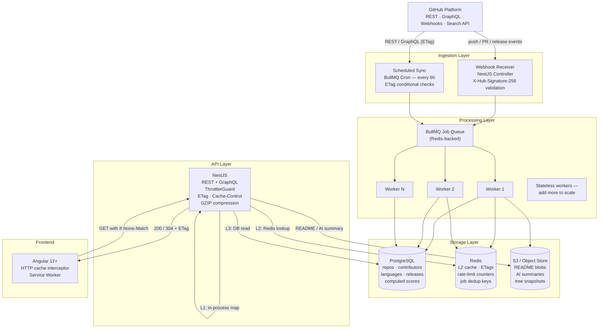
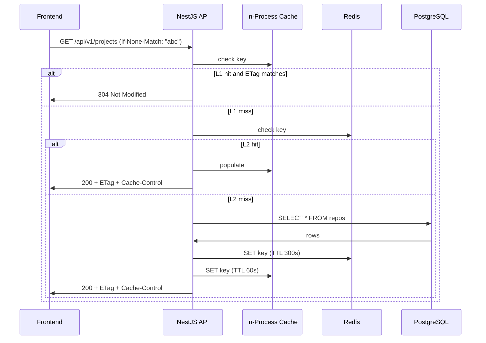
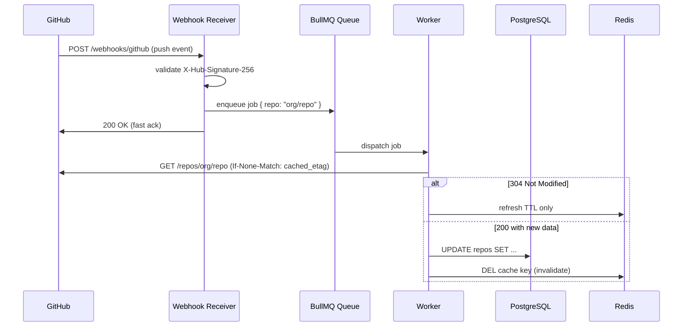

# Architecture Diagram

## Full System — Mermaid



---

## Cache Hit Flow



---

## Webhook Update Flow



---

## Scalability: 300 → 10,000 Repos

```
300 repos                          10,000 repos
─────────────────────────────────────────────────────────────────────
1 GitHub token                     Token pool (5-10 tokens)
  5,000 req/hr shared                Round-robin by remaining quota
                                     tracked in Redis

2 BullMQ workers                   20+ workers (horizontal scale)
  single Redis instance              Redis Cluster (sharded)

Single PostgreSQL                  PostgreSQL + 2 read replicas
                                     Partitioned by org prefix

Single NestJS instance             NestJS behind load balancer
                                     All state external (Redis + PG)

Single cron job (6h scan)          Distributed BullMQ repeat jobs
                                     Sharded by repo ID range
                                     Different tokens per shard
```
